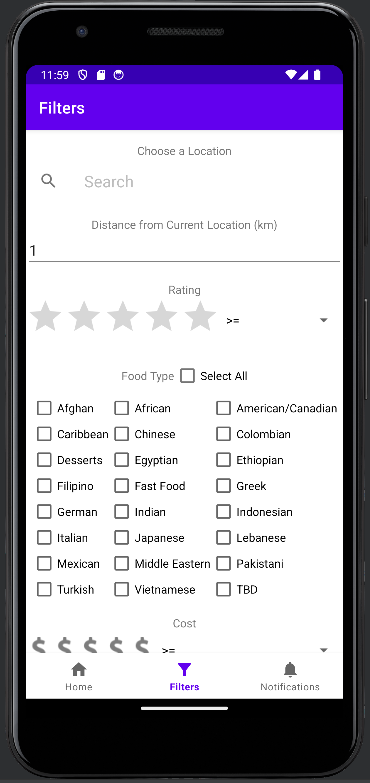
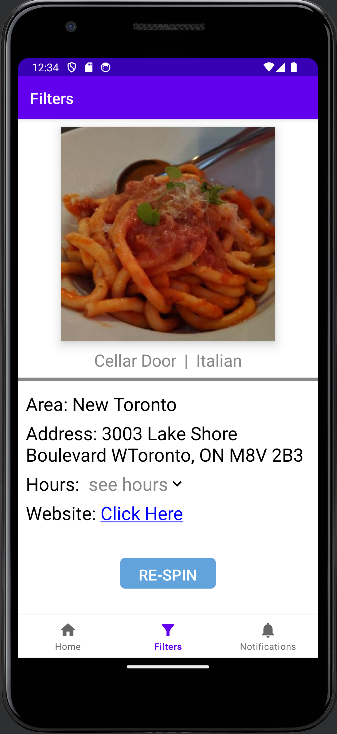

# Pick-E-Eater

Android application that helps picky eaters decide where to eat. When given a starting location, distance and various other filters, the application randomly picks a restaurant based on these settings for you to eat from. You can provide filters such as a rating, price range, and or food type.

## Built With
- Kotlin
- Google Map APIs
- SQLite
- Jetpack Compose

 


## Testing

Please ensure you include a Google Maps API Key while testing or using the application. Currently using in our buildConfig the MAPS_API_KEY which should be included in a local.properties file to properly work.

local.properties
```
MAPS_API_KEY="INSERT YOUR KEY HERE"
```

## Roadmap

- [ ] Add more restaurants to the database
- [ ] Add ability to input cost and rating for restaurants
- [ ] Publish the application in the app store